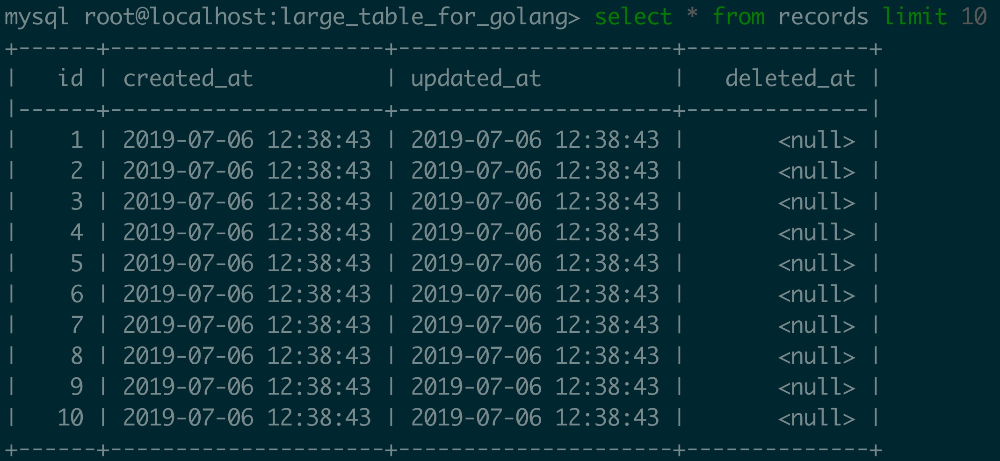

# Query Large table in Go


> Take home message1: Query DB by bucket and use go routine to parallel them.

> Take home message2: All code is on [Adoni/golang-query-large-table · GitHub](https://github.com/Adoni/golang-query-large-table)

Sometimes we need to load data from database. Say there are 1 million records and we want to load all their object id into memory. What could we do? To make things clear, we assume the table structure is so simple that it only contains one column called object id.

A snapshot of the table is



And the definition of table ORM is:

```go
type Record struct {
    gorm.Model
    Id uint `gorm:"column:object_id"`
}
```

> Don’t know ORM (Object Relational Mapping)? Please visit [stack overflow](https://stackoverflow.com/questions/1279613/what-is-an-orm-how-does-it-work-and-how-should-i-use-one), [wiki](https://en.wikipedia.org/wiki/Object-relational_mapping) and [gorm guides.](https://gorm.io/docs/)

And a helper function is constructed to measure how much time a function takes to finish:

```go
func timeTrack(start time.Time, name string) {
    elapsed := time.Since(start)
    fmt.Printf("%s tooks %s\n", name, elapsed)
}
```

## Method 1: Just do ordinary query and leave everything to mysql and go

Yes, we can do that, which is very straightforward and the code is simple:

```go
func method1(db *gorm.DB) {
    records := make([]Record, 0)
    defer timeTrack(time.Now(), "Method 1")
    db.Table("records").Select("id").Limit(1000000).Find(&records)
}
```

The output is 

```
Method 1 tooks 5.753609157s
```

Obviously, it can cost substantial time to load all records. To make it worse, what we can do before result comes out is just waiting or having a cup of coffee.

## Method 2: Divide table into buckets and query them one by one

Method 1 cannot show any query process, which would make some programmer, like me, crazy. To show how much information we’ve processed so far, we can chunk the entire ids into sequential buckets or batches, and then query them one by one. Like that:

```go
func method2(db *gorm.DB) {
    records := make([]Record, 0)
    defer timeTrack(time.Now(), "Method 2")
    count := 1000000
    bucketSize := 100000
    for beginId :=1; beginId <=count; beginId += bucketSize {
        fmt.Printf("%d of %d\n", beginId, count)
        currentRecords := make([]Record, 0)
        db.Table("records").Select("id").Where("id>=? and id<?", beginId, beginId+bucketSize).Find(&currentRecords)
        records = append(records, currentRecords...)
    }
}
```

The output is
```
1 of 1000000
100001 of 1000000
200001 of 1000000
300001 of 1000000
400001 of 1000000
500001 of 1000000
600001 of 1000000
700001 of 1000000
800001 of 1000000
900001 of 1000000
Method 2 tooks 5.561521983s
```

Things is much better because we can know how much ids we’ve queried and know how much time it may takes to finish if we want  (simple math). But the *efficiency* is almost the same with method 1. 

## Method 3: Divide table into buckets and query them parallel

Notice that I replace “one by one ” by “parallel”. And to parallelize the for loop, what we need id *go routine*. Here we wrap each query into an anonymous function and use a channel to accept the final results. The code is here:


```go
func method3(db *gorm.DB) {
    records := make([]Record, 0)
    defer timeTrack(time.Now(), "Method 3")
    count := 1000000
    bucketSize := 100000
    resultCount := 0
    resultChannel := make(chan []Record, 0)
    for beginID :=1; beginID <=count; beginID += bucketSize {
        endId := beginID +bucketSize
        go func(beginId int, endId int) {
            currentRecords := make([]Record, 0)
            db.Table("records").Select("id").Where("id>=? and id<?", beginId, endId).Find(&currentRecords)
            resultChannel <- currentRecords
        }(beginID, endId)
        resultCount += 1
    }
    for i:=0; i<resultCount; i++{
        currentRecords := <- resultChannel
        records = append(records, currentRecords...)
    }
}
```

The output is 

```
0 of 10
1 of 10
2 of 10
3 of 10
4 of 10
5 of 10
6 of 10
7 of 10
8 of 10
9 of 10
Method 3 tooks 1.386305598s
```

We can find method 3 is *4 times faster* than method 1.

During the code running, I’m watching the CPU status. And only method 3 makes CPU work at fully capacity, which makes me believe that that’s the best I can do for now.

